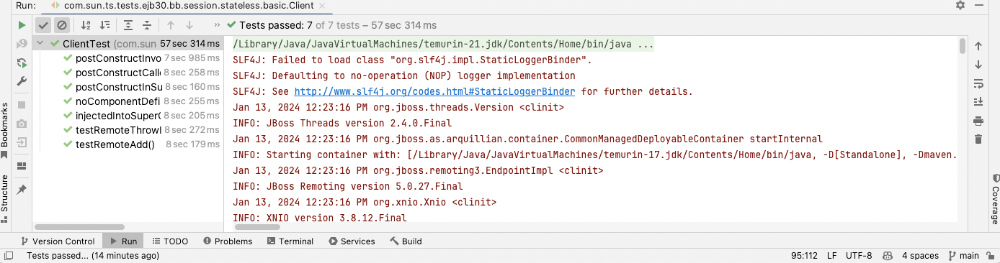

# wildfly-eetck
Example runner for WildFly and the updated Arquillian/Junit5 EE TCK tests

## Preparing to run the tests
In order to run these tests, the WildFly Arquillian container and the Jakarta EE TCK Arquillian/Junit5 tests must be built.
There are two repositories to clone and build:

Build the WildFly Arquillian container:
git clone https://github.com/starksm64/wildfly-arquillian.git
cd wildfly-arquillian
mvn install

Build the Jakarta EE TCK Arquillian/Junit5 tests:
git clone https://github.com/jakartaredhat/jakartaee-tck.git
cd jakartaee-tck
git checkout ejb-arq-test
mvn install

## Running the tests from the command line
From within the wildfly-eetck directory, run the following command:
mvn test


The current status of the 3 test classes is:
```bash
(base) starksm@Scotts-Mac-Studio wildfly-eetck % mvn test
[INFO] Scanning for projects...
...
[INFO] --- maven-surefire-plugin:3.1.2:test (default-test) @ wildfly-tck-runner ---
[INFO] Tests are skipped.
[INFO] 
[INFO] --- maven-surefire-plugin:3.1.2:test (appclient-tests-tck) @ wildfly-tck-runner ---
[INFO] Using auto detected provider org.apache.maven.surefire.junitplatform.JUnitPlatformProvider
[INFO]
[INFO] -------------------------------------------------------
[INFO]  T E S T S
[INFO] -------------------------------------------------------
[INFO] Running com.sun.ts.tests.ejb30.bb.session.stateless.basic.ClientTest
[INFO] Tests run: 7, Failures: 0, Errors: 0, Skipped: 0, Time elapsed: 59.32 s -- in com.sun.ts.tests.ejb30.bb.session.stateless.basic.ClientTest
[INFO] Running com.sun.ts.tests.ejb30.bb.session.stateless.annotation.appexception.annotated.ClientTest
[INFO] Tests run: 10, Failures: 0, Errors: 0, Skipped: 0, Time elapsed: 82.18 s -- in com.sun.ts.tests.ejb30.bb.session.stateless.annotation.appexception.annotated.ClientTest
[INFO] Running com.sun.ts.tests.ejb30.bb.session.stateless.annotation.enventry.ClientTest
[INFO] Tests run: 18, Failures: 0, Errors: 0, Skipped: 0, Time elapsed: 147.8 s -- in com.sun.ts.tests.ejb30.bb.session.stateless.annotation.enventry.ClientTest
[INFO] 
[INFO] Results:
[INFO] 
[INFO] Tests run: 35, Failures: 0, Errors: 0, Skipped: 0
...
```

The failures in the com.sun.ts.tests.ejb30.bb.session.stateless.annotation.appexception.annotated.ClientTest
appear to be due to either missing exception mappings or some other transaction/exception configuration
that is not being set correctly.

## Running the tests from within Intellij
The project has Junit run configurations for the 3 test classes, and the tests can be run from within Intellij.
.
